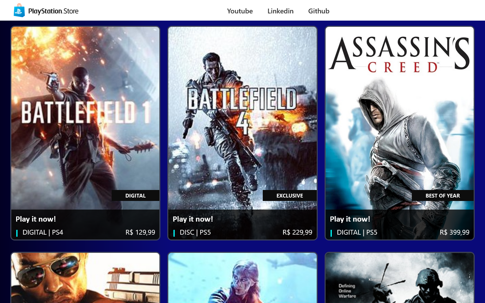

<h1 align="center">🏆 Desafio de projeto - Clone da PlayStation Store</h1>

  
   Este projeto foi criado com a finalidade de praticar os conhecimentos adquiridos através do curso de Angular da plataforma de estudos da DIO.

<h2>Conheça o projeto clicando na imagem abaixo:</h2>

### Tecnologias Utilizadas

-  HTML 5
-  CSS 3
-  Typescript
-  Angular 14

### Como experimentar
1. Clone este repositório para sua máquina local.
2. Abra o projeto pelo vscode
3. Execute através do terminar o comando 'ng serve'
4. Aguarde até que o terminal avise que a execução está completa
5. Abra o seu navegador web e acesse o endereço http://localhost:4200/

### Créditos

Este projeto foi desenvolvido como parte de um desafio educacional da Digital Innovation One.

### Desenvoledor

-  Thales A Cardoso
-  <a href="https://www.linkedin.com/in/thalesacardoso/">
      Linkedin
   </a>
-  <a href="https://github.com/thalesacardoso">
      Github
   </a>
